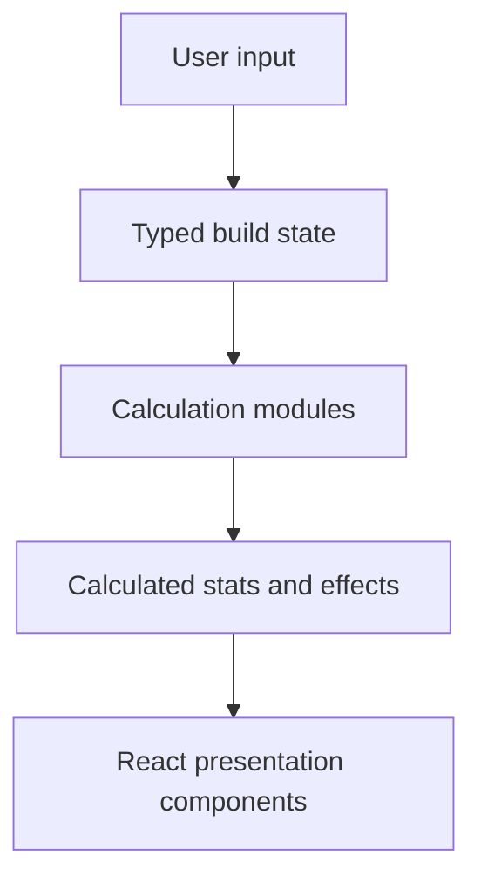

# CAM Lab

CAM Lab is a modern build planner and stat calculator for **Catch a Monster**, built with **React**, **Next.js**, **TypeScript**, and **Tailwind CSS**.

The project turns game data and player-tested formulas into an interactive tool for exploring monsters, creating builds, and understanding how each modifier affects combat statistics. Its interface is inspired by detailed planning tools such as Path of Building and PCPartPicker while remaining approachable for regular players.

## Access the Site

Use CAM Lab directly in your browser:

**[Open CAM Lab](https://jjeastside.github.io/catch-a-monster-labs/)**

No installation is required. The current build is hosted on GitHub Pages and is automatically redeployed from the `main` branch. Development updates through **v1.0.5** are documented in the [CAM Lab Changelog](https://jjeastside.github.io/catch-a-monster-labs/changelog/).

## Current Features

### Monster Browser

- Search and browse the complete roster of 231 monsters
- Filter by source, island, rarity, element, availability, evolution status, and passive
- Sort by Index, DPS, Damage, or Health with passive-aware comparison modes and Evolution Multiplier control
- Compact and expanded browser views
- Monster artwork, element icons, rarity styling, and source information
- Detailed monster overview with skills and availability requirements
- Persistent favorites and selected-monster state after refreshing the page
- Direct monster links using URL hashes

### Monster Database

- Dedicated visual database for the complete monster roster
- Search, sorting, and filters for rarity, element, source, location, availability, passives, skill effects, and evolution status
- Damage, Health, DPS, and Index comparison modes
- Evolution Multiplier and passive-aware stat comparisons
- Monster profiles with artwork, skills, passives, reference stats, obtainment details, evolution families, and calculator links
- Fixed profile drawer that preserves the user's place in the monster grid and resets each selected profile to the top
- Shareable profile routes with a Copy Link action
- Compact mobile cards, a sticky results toolbar, and a dedicated mobile filter drawer

### Build Editor

- Level and rank configuration
- Enhancements from `+0` through `+10`
- Genetic Potential for Damage and Health
- Breed Attack and Breed Health values
- Evolution Multiplier with `0.01%` precision
- Standard and X mutation variants
- Weapon and armor selection
- Rarity-based equipment attribute slots
- Trait selection with rarity-specific visuals
- Teammate selection for transferable passives and skill effects
- Combat-condition controls for contextual passives, target types, and active skill effects
- Optional Experimental Mode for level 106–110 previews

### Calculation Engine

- Base Health and Damage calculations
- Piecewise level-growth formulas
- Rank, enhancement, Genetic Potential, breed, and evolution scaling
- Mutation and X-mutation modifiers
- Equipment and attribute multipliers
- Trait effects
- Account achievement multipliers
- Conditional personal and teammate passive effects
- Normal, critical, and expected skill-damage previews
- Multi-hit, chance-based, cooldown-adjusted, and total skill DPS calculations
- Healing, Healing Per Second, shielding, cooldown, resistance, and damage-reduction effects
- Healing calculations that remain independent of critical chance and critical damage
- Structured Damage Increase, Vulnerability, Stun, Poison, and Burn effects
- Vulnerability- and Damage Increase-boosted damage results without double stacking
- Boss, Rift, Spire, dungeon, and HP-threshold conditions

### Calculator Results

- Combined combat-stat summary
- Skill analysis for every monster skill
- Normal, Critical, DPS, Healing, and HPS result comparisons where applicable
- Structured effect cards for buff amount, target, duration, stack count, and activation requirements
- Compact help tooltips for detailed Poison and Burn behavior
- Passive-effect breakdown with accurate personal and teammate counts
- Equipment, attribute, mutation, and trait summaries
- Advanced Health and Damage formula breakdowns
- Growth preview graph
- Copyable calculation values
- Consistent large-number formatting

### Account Multipliers

- Path of Progress tracking
- Index Mania tracking
- Sequential Pet Quest tracking
- Rift Challenger support
- `Striver for Perfection` support
- Automatic combined Health, Damage, Rift Damage, and Critical Chance bonuses

### Sharing and Persistence

- Persistent active build, favorites, and selected monster in browser storage
- Three local build save/load slots
- Compact shared-build URLs that preserve calculator-relevant build state
- Short share IDs for links that are easier to post in Discord and other communities
- Cloudflare-powered rich previews with monster artwork, rarity styling, and calculated build stats
- Stable restoration of equipment, attributes, achievements, teammates, combat conditions, and other packed selections

### Interface and Deployment

- Responsive three-panel desktop interface
- Mobile Monster, Results, and Build views
- CAM Lab navy visual theme
- Rarity-specific Legendary, Mythical, Secret, and Void presentation
- Changelog, patch-notes, and work-in-progress pages
- Static Next.js export deployed automatically through GitHub Actions
- Routing and public assets configured for the GitHub Pages repository path

## Tech Stack

| Technology                        | Purpose                                                             |
| --------------------------------- | ------------------------------------------------------------------- |
| React                             | Interactive component-based interface and state updates             |
| Next.js                           | Application structure, routing, static export, and deployment build |
| TypeScript                        | Type-safe data models and calculation logic                         |
| Tailwind CSS                      | Responsive styling and reusable visual patterns                     |
| CSV and JavaScript import scripts | Maintainable source data and generated TypeScript records           |
| Browser local storage             | Build slots, favorites, and selected-monster persistence            |
| Cloudflare Workers and KV         | Short build links, stored preview data, and dynamic social cards    |
| GitHub Actions                    | Automated build and GitHub Pages deployment                         |
| Git and GitHub                    | Version control, project history, and hosting                       |

## How It Works

CAM Lab uses a centralized calculation pipeline:



1. The user selects a monster and modifies its build.
2. React updates the typed build state.
3. Independent calculation modules apply growth, rank, enhancement, mutation, equipment, trait, passive, achievement, combat-context, and structured skill-effect modifiers.
4. The engine returns calculated statistics, skill results, and effect summaries.
5. React renders the results immediately and saves the build state locally.

Keeping the calculation engine separate from the presentation layer makes individual formulas easier to test, explain, and update without rewriting the interface.

## Architecture and Interview Talking Points

This project demonstrates more than a finished interface. It documents the process of converting uncertain game behavior into a maintainable software model.

### Separation of Concerns

- UI components collect input and display results.
- Shared TypeScript types define the data contracts between systems.
- Calculation modules contain game formulas independently of visual components.
- Generated data files keep large monster, skill, and skill-effect datasets separate from hand-written logic.

### Data-Driven Design

Monsters, skills, skill effects, equipment, attributes, traits, achievements, and passives are represented as structured data. Adding content usually requires a data entry rather than a new custom component or calculation path.

### Modifier Composition

The calculation pipeline distinguishes additive bonuses, multiplicative modifiers, conditional effects, and context-dependent rules. This is important because combining every percentage in the same way would produce incorrect results. Active Damage Increase and Vulnerability effects are also resolved without applying the same source twice.

### State and Persistence

The editor uses one typed build state as its source of truth. Derived results are recalculated from that state, while browser storage restores the active build, saved slots, favorites, and selected monster after a refresh. The same state model is serialized into compact shared-build links.

### Validation Through Testing

Many formulas were determined by controlled in-game comparisons. Baseline values were recorded, one variable was changed at a time, and competing formulas were checked against observed results before implementation.

### Static Deployment

CAM Lab is exported as static HTML, CSS, and JavaScript. A shared asset-path utility allows the same codebase to work at `localhost:3000` and under GitHub Pages' `/catch-a-monster-labs` repository path. A separate Cloudflare Worker handles short links and dynamic social-preview cards without requiring a traditional application server.

## Project Structure

```text
.github/
└── workflows/              # Automated GitHub Pages deployment
app/
├── components/             # Browser, editor, result, navigation, and shared UI
├── data/                   # Equipment, traits, passives, and generated game data
├── data-source/            # Maintainable CSV source files
├── lib/                    # Asset helpers and calculation modules
├── scripts/                # Data-import and asset-validation scripts
├── types/                  # Shared TypeScript interfaces
├── monster-database/       # Visual database and direct monster profile routes
├── changelog/              # Development changelog
├── updates/                # Game patch notes
├── work-in-progress/       # Placeholder route for upcoming pages
├── layout.tsx
└── page.tsx
cloudflare-share-worker/    # Short links and dynamic shared-build previews
public/                     # Monster artwork and interface icons
```

## Local Development

Clone the repository:

```bash
git clone https://github.com/jjeastside/catch-a-monster-labs.git
cd catch-a-monster-labs
```

Install dependencies:

```bash
npm install
```

Start the development server:

```bash
npm run dev
```

Open [http://localhost:3000](http://localhost:3000) in your browser.

Create a production build:

```bash
npm run build
```

Run the automated tests:

```bash
npm test
```

## Progress and Roadmap

### Completed

- [x] Monster browser, search, advanced filters, favorites, and stat sorting
- [x] Responsive desktop and mobile calculator layouts
- [x] Growth, rank, enhancement, GP, breed, and evolution formulas
- [x] Mutation and X-mutation calculations
- [x] Equipment and attribute system
- [x] Achievement-based account multipliers
- [x] Conditional personal and teammate passive multipliers
- [x] Trait system
- [x] Skill, critical-hit, healing, HPS, shielding, cooldown, and total DPS analysis
- [x] Structured Damage Increase, Vulnerability, Stun, Poison, and Burn effects
- [x] Advanced formula breakdowns and growth visualization
- [x] Browser-based active-build, save-slot, favorite, and monster persistence
- [x] Dedicated visual Monster Database with mobile support
- [x] Sortable monster stat comparisons and advanced database filters
- [x] Direct monster profile links
- [x] Compact shared builds, short IDs, and rich preview cards
- [x] Changelog and patch-notes pages
- [x] GitHub Pages static deployment

### Planned

- [ ] Expanded favorites management
- [ ] Named build slots
- [ ] Full skill-rotation and sustained-DPS comparisons
- [ ] Equipment optimization tools
- [ ] Reverse base-stat solver
- [ ] Account synchronization across devices
- [ ] Complete Guides, Compare, Feedback, About, and Privacy pages
- [ ] Additional automated calculation tests

## Why I Built This

I built CAM Lab to create a genuinely useful community tool while strengthening my ability to design and explain a real application. The project combines UI design, data modeling, TypeScript architecture, reverse engineering, controlled testing, formula validation, and automated deployment.

Instead of treating the calculator as a collection of unrelated inputs, I designed it around a centralized build model and composable calculation pipeline. This makes the project easier to extend and gives me concrete engineering decisions to discuss in interviews, including state management, separation of concerns, data-driven design, validation strategy, static-hosting constraints, and tradeoffs between accuracy and maintainability.

## Fan-Site Notice

CAM Lab is an independent, fan-made companion site. It is not affiliated with, endorsed by, or sponsored by Roblox Corporation or LDS II. Game names, trademarks, characters, and related game assets remain the property of their respective owners.

## License and Usage

Copyright © 2026 `@jjeastside`. All rights reserved.

The source code and original CAM Lab materials in this repository are publicly available for viewing, educational review, and portfolio evaluation only. No permission is granted to copy, reproduce, redistribute, publish, sell, sublicense, or create derivative projects from this repository without prior written authorization from the copyright owner.

Third-party trademarks, game artwork, names, and other referenced assets are excluded from this copyright claim and remain subject to the rights of their respective owners.
