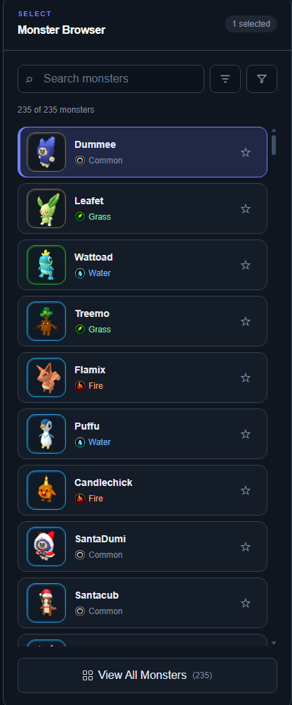
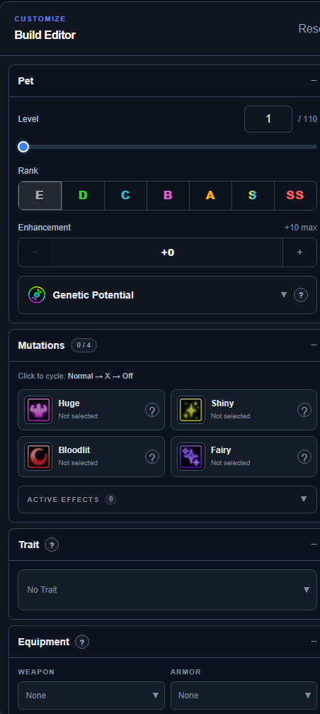
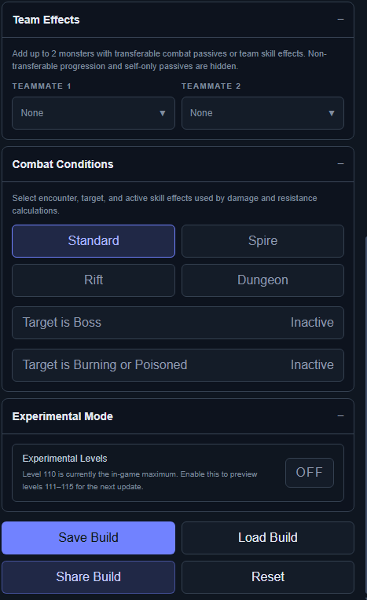
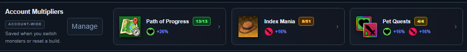
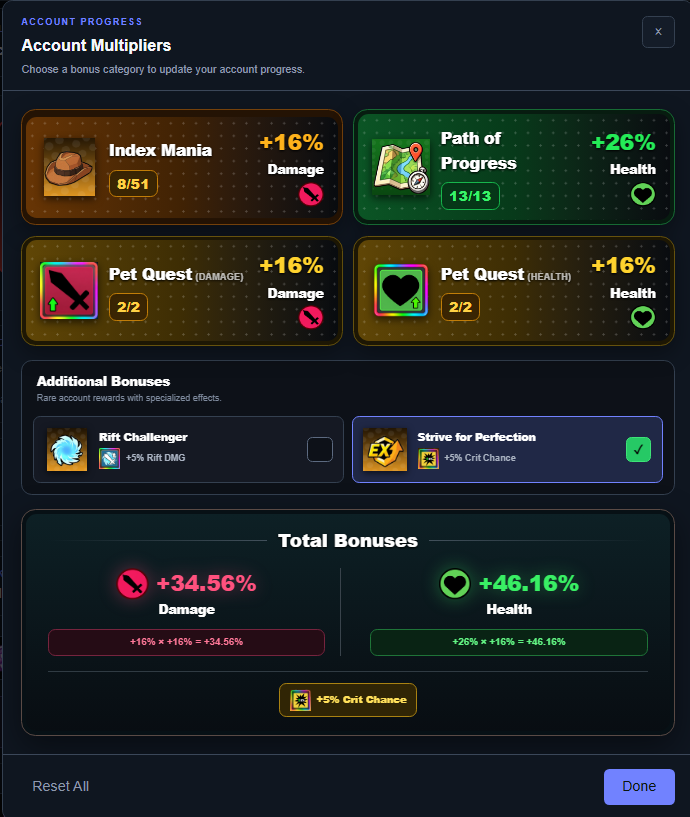
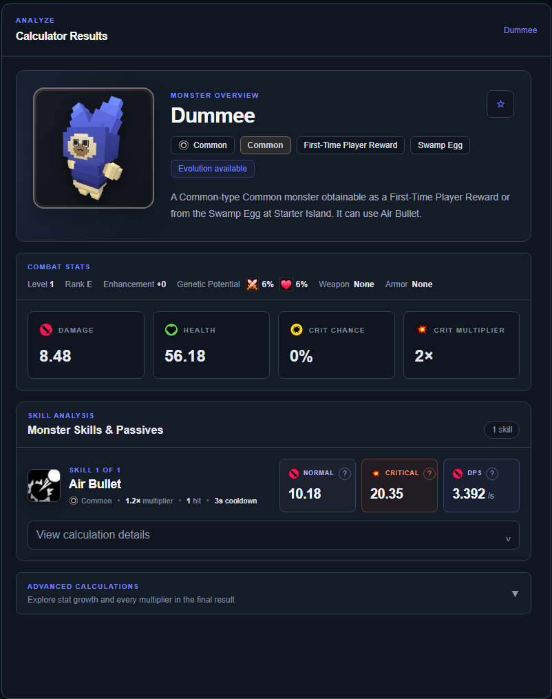
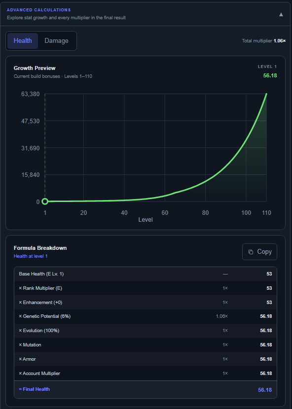
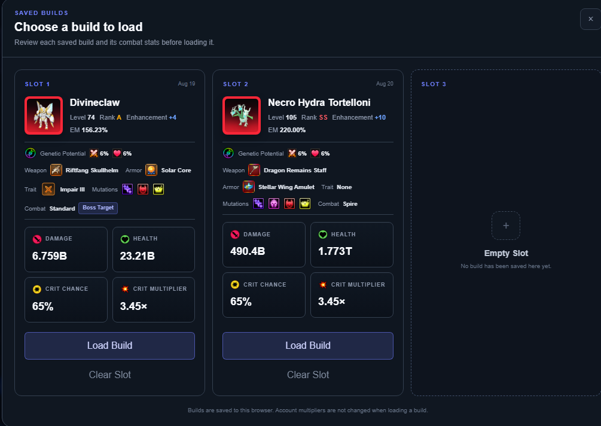
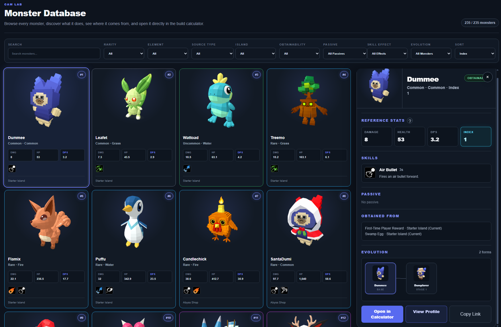
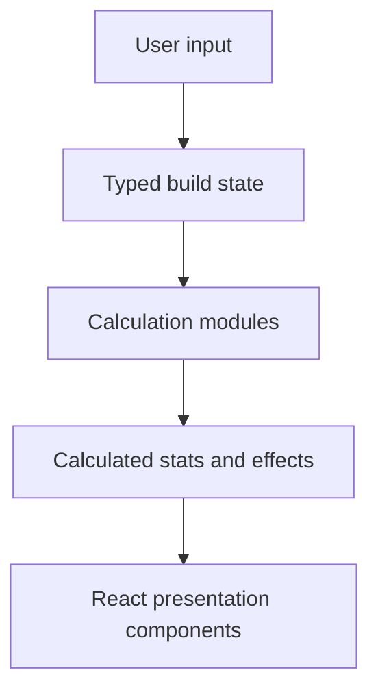

# Cam Lab

**Cam Lab** is a build planner, stat calculator, monster database, and collection tracker for **Catch a Monster**, built with **React**, **Next.js**, **TypeScript**, and **Tailwind CSS**.

It turns game data and player-tested formulas into an interactive tool for exploring monsters, creating builds, comparing combat results, and understanding how individual modifiers affect final stats.

The goal is to provide the depth of a serious theorycrafting tool while keeping the interface approachable for everyday players.

## Access the Site

Use Cam Lab directly in your browser:

**[Open Cam Lab](https://jjeastside.github.io/catch-a-monster-labs/)**

No installation is required. The current build is hosted on GitHub Pages and is automatically redeployed from the `main` branch.

Development updates through **v1.0.8** are documented in the [Cam Lab Changelog](https://jjeastside.github.io/catch-a-monster-labs/changelog/).

---

## What Cam Lab Does

Cam Lab is built around three main player-facing sections:

- **Calculator** — browse monsters, configure builds, manage account multipliers, and analyze results.
- **Monster Database** — explore the roster in a reference-first layout with detailed monster profiles.
- **Index Tracker** — track collection progress, ranks, mutation bonuses, breeding genders, and total Index Score.

Under the hood, those sections are powered by a shared calculation engine that handles Health, Damage, skill damage, DPS, healing, shielding, cooldowns, and structured combat effects.

---

## Calculator

The calculator is the core of Cam Lab. It is designed to take a monster from discovery to full build planning, then turn that build into clear and explainable results.

### Monster Browser

The Monster Browser is the main entry point into the calculator. It keeps a large roster easy to search while still exposing the filters and comparison tools needed for theorycrafting.



Players can:

- Search and browse the complete roster of **235 monsters**
- Filter by source, island, rarity, element, availability, evolution status, and passive
- Sort by Index, DPS, Damage, or Health
- Use passive-aware comparison modes and Evolution Multiplier controls
- Switch between compact and expanded browser views
- View monster artwork, element icons, rarity styling, skills, and source information
- Save favorites and restore the selected monster after refreshing the page
- Link directly to monsters using URL hashes

### Build Editor

After selecting a monster, the Build Editor becomes the central workspace for configuring the complete build.



A build can include:

- Level and rank
- Enhancements from `+0` through `+10`
- Genetic Potential for Damage and Health
- Breed Attack and Breed Health values
- Evolution Multiplier with `0.01%` precision
- Standard and X mutation variants
- Weapon and armor selection
- Rarity-based equipment attribute slots
- Trait selection with rarity-specific visuals
- Teammates with transferable passives and skill effects
- Combat conditions for contextual passives, target types, and active skill effects
- Optional Experimental Mode for level **111–115** previews

The editor uses one typed build state as the source of truth, allowing the same configuration to drive calculations, saved builds, and shared links.

### Teammates and Combat Conditions

Some Catch a Monster effects only apply under specific encounter conditions, so Cam Lab models those separately instead of treating every bonus as permanently active.



This lets the calculator account for effects such as:

- Personal and teammate passives
- Boss, Rift, Spire, and dungeon bonuses
- HP-threshold effects
- Active Damage Increase and Vulnerability effects
- Skill-specific buffs and debuffs
- Target-dependent effects

### Account Multipliers

Account progression can also be entered directly into the calculator so account-wide bonuses are reflected in the final build.



The compact Account Multipliers panel gives quick access to your saved progress and shows the bonus categories currently affecting the build.



The full manager provides a more detailed view of each progression source and automatically combines the selected bonuses into the correct totals.

Supported progression includes:

- Path of Progress
- Index Mania
- Sequential Pet Quests
- Rift Challenger
- `Striver for Perfection`

Cam Lab automatically combines the resulting Health, Damage, Rift Damage, and Critical Chance bonuses with the rest of the build.

### Calculator Results

The Results panel updates immediately as the build changes, making it easy to see the impact of each rank, mutation, trait, equipment piece, or combat condition.



It includes:

- Combined combat-stat summaries
- Skill analysis for every monster skill
- Normal, Critical, DPS, Healing, and HPS values where applicable
- Passive-effect breakdowns with separate personal and teammate counts
- Equipment, attribute, mutation, and trait summaries
- Copyable calculation values
- Consistent large-number formatting

### Structured Skill Effects

Cam Lab does more than calculate direct damage. Skills can also contain structured effects that are displayed with their amount, target, duration, stack count, or activation requirements.

Currently modeled effects include:

- Damage Increase
- Damage Decrease
- Damage Reduction
- Damage Reflection
- Vulnerability
- Stun
- Poison
- Burn
- Healing
- Shield
- Knockback
- Taunt

Healing calculations remain independent of Critical Chance and Critical Damage, and active Damage Increase or Vulnerability sources are resolved without applying the same source twice.

### Advanced Calculations

For players who want to understand *why* a number changed—not just what the final number is—Cam Lab exposes the formulas and multiplier breakdowns behind the result.



The calculation engine supports:

- Base Health and Damage calculations
- Piecewise level-growth formulas
- Rank, enhancement, Genetic Potential, breed, and evolution scaling
- Mutation and X-mutation modifiers
- Equipment and attribute multipliers
- Trait effects
- Account achievement multipliers
- Conditional personal and teammate passive effects
- Normal, critical, and expected skill-damage previews
- Multi-hit and chance-based skills
- Cooldown-adjusted and total skill DPS
- Healing and Healing Per Second
- Shielding
- Cooldown modification
- Resistance and damage-reduction effects
- Boss, Rift, Spire, dungeon, and HP-threshold conditions

Many formulas were determined through controlled in-game testing: a baseline value was recorded, one variable was changed at a time, and competing formulas were checked against the observed result before implementation.

### Saved Builds and Sharing

Builds are stored locally so players can experiment, save setups, and share configurations without needing an account.



Cam Lab currently supports:

- Persistent active builds, favorites, and selected monsters in browser storage
- Three local build save/load slots
- Compact shared-build URLs that preserve calculator-relevant state
- Short share IDs that are easier to post in Discord and other communities
- Cloudflare-powered rich previews with monster artwork, rarity styling, and calculated build stats
- Restoration of equipment, attributes, achievements, teammates, combat conditions, and other packed selections

## Monster Database

The dedicated Monster Database turns the roster into a full reference library.


It is designed for players who want to research monsters before building them. You can filter the entire roster, compare reference stats, and inspect a detailed profile without losing your place in the grid.

It includes:

- Search, sorting, and advanced filters for rarity, element, source, location, availability, passives, skill effects, and evolution status
- Damage, Health, DPS, and Index comparison modes
- Evolution Multiplier and passive-aware stat comparisons
- Monster profiles with artwork, skills, passives, reference stats, obtainment details, and evolution families
- Direct links back into the calculator
- Shareable monster profile routes with a **Copy Link** action
- A fixed profile drawer that preserves the user's place in the monster grid
- Compact mobile cards, a sticky results toolbar, and a dedicated mobile filter drawer
- Clear descriptions and matching effect icons for all **133 skills**
- Reference-stat comparison details through a compact help tooltip

## Index Tracker

The Index Tracker turns collection progress into a visual checklist instead of forcing players to calculate and remember their score manually.



At a glance, players can see their current score, completion percentage, remaining points, missing upgrades, and which monsters still need attention.

The tracker can:

- Record every monster's highest rank
- Track Shiny, Bloodlit, Fairy, and Huge bonuses
- Calculate Index Score, completion percentage, average score, and remaining points automatically
- Filter by All, Incomplete, Complete, Missing Monster, and Missing Bonuses
- Bulk edit large portions of the collection
- Temporarily hide monsters while working through a bulk update
- Track Male and Female breeding availability
- Filter and bulk-edit breeding genders
- Save progress automatically in the browser
- Export and import progress as JSON for backups

## Community and Project Pages

The site also includes supporting pages around the calculator itself:

- **About** — explains Cam Lab's goals and development approach
- **Changelog** — tracks Cam Lab releases
- **Patch Notes** — records Catch a Monster game updates separately from site changes
- **Privacy Policy** — explains local storage, shared builds, and feedback handling
- **Feedback** — allows players to submit bug reports, feature requests, and data corrections

---

## Tech Stack

| Technology | Purpose |
|---|---|
| React | Interactive component-based interface and state updates |
| Next.js | Application structure, routing, static export, and deployment build |
| TypeScript | Type-safe data models and calculation logic |
| Tailwind CSS | Responsive styling and reusable visual patterns |
| CSV and JavaScript import scripts | Maintainable source data and generated TypeScript records |
| Browser local storage | Build slots, favorites, Index progress, and selected-monster persistence |
| Cloudflare Workers and KV | Short build links, stored preview data, and dynamic social cards |
| GitHub Actions | Automated build and GitHub Pages deployment |
| Git and GitHub | Version control, project history, and hosting |

---

## How It Works

Cam Lab uses a centralized calculation pipeline:



1. The user selects a monster and modifies its build.
2. React updates the typed build state.
3. Independent calculation modules apply growth, rank, enhancement, mutation, equipment, trait, passive, achievement, combat-context, and structured skill-effect modifiers.
4. The engine returns calculated statistics, skill results, and effect summaries.
5. React renders those results immediately and saves the relevant state locally.

Keeping the calculation engine separate from the presentation layer makes individual formulas easier to test, explain, and update without rewriting the interface.

---

## Architecture

### Separation of Concerns

- UI components collect input and display results.
- Shared TypeScript types define the data contracts between systems.
- Calculation modules contain game formulas independently of visual components.
- Generated data files keep large monster, skill, and skill-effect datasets separate from hand-written logic.

### Data-Driven Design

Monsters, skills, skill effects, equipment, attributes, traits, achievements, and passives are represented as structured data.

Adding new game content therefore usually requires updating data rather than creating a new custom component or calculation path.

### Modifier Composition

The calculation pipeline distinguishes between:

- Additive bonuses
- Multiplicative modifiers
- Conditional effects
- Context-dependent rules

That distinction matters because combining every percentage in the same way would produce incorrect results.

### State and Persistence

The editor uses one typed build state as its source of truth.

Derived results are recalculated from that state, while browser storage restores the active build, saved slots, favorites, Index progress, and selected monster after a refresh.

The same state model is also serialized into compact shared-build links.

### Static Deployment

Cam Lab is exported as static HTML, CSS, and JavaScript.

A shared asset-path utility allows the same codebase to work at `localhost:3000` and under GitHub Pages' `/catch-a-monster-labs` repository path.

A separate Cloudflare Worker handles short links and dynamic social-preview cards without requiring a traditional application server.

---

## Project Structure

```text
.github/
└── workflows/              # Automated GitHub Pages deployment
app/
├── components/             # Browser, editor, result, navigation, and shared UI
├── data/                   # Equipment, traits, passives, and generated game data
├── data-source/            # Maintainable CSV source files
├── lib/                    # Asset helpers and calculation modules
├── scripts/                # Data-import and asset-validation scripts
├── types/                  # Shared TypeScript interfaces
├── monster-database/       # Visual database and direct monster profile routes
├── changelog/              # Development changelog
├── updates/                # Game patch notes
├── work-in-progress/       # Placeholder route for upcoming pages
├── layout.tsx
└── page.tsx
cloudflare-share-worker/    # Short links and dynamic shared-build previews
public/                     # Monster artwork and interface icons
```

---

## Local Development

Clone the repository:

```bash
git clone https://github.com/jjeastside/catch-a-monster-labs.git
cd catch-a-monster-labs
```

Install dependencies:

```bash
npm install
```

Start the development server:

```bash
npm run dev
```

Open [http://localhost:3000](http://localhost:3000) in your browser.

Create a production build:

```bash
npm run build
```

Run the automated tests:

```bash
npm test
```

---

## Progress and Roadmap

### Completed

- [x] Monster browser, search, advanced filters, favorites, and stat sorting
- [x] Responsive desktop and mobile calculator layouts
- [x] Growth, rank, enhancement, GP, breed, and evolution formulas
- [x] Mutation and X-mutation calculations
- [x] Equipment and attribute system
- [x] Achievement-based account multipliers
- [x] Conditional personal and teammate passive multipliers
- [x] Trait system
- [x] Skill, critical-hit, healing, HPS, shielding, cooldown, and total DPS analysis
- [x] Structured skill effects for buffs, debuffs, damage over time, healing, shields, crowd control, and reflection
- [x] Advanced formula breakdowns and growth visualization
- [x] Browser-based active-build, save-slot, favorite, and monster persistence
- [x] Dedicated visual Monster Database with mobile support
- [x] Sortable monster stat comparisons and advanced database filters
- [x] Direct monster profile links
- [x] Complete skill descriptions and structured skill-effect filtering
- [x] Index Tracker with bulk editing, backups, and breeding-gender tracking
- [x] Compact shared builds, short IDs, and rich preview cards
- [x] Changelog, patch notes, Feedback, About, and Privacy pages
- [x] GitHub Pages static deployment

### Planned

#### Calculator Functionality

- [ ] Add team composition calculations for all three equipped monsters
- [ ] Add an Enemy page with enemy locations, Health, and scaling information
- [ ] Add an Egg page that shows all egg items
- [ ] Add a trait, gear, and mutation optimization tool using equipment and team inputs
- [ ] Add side-by-side build comparisons

#### Research

- [ ] Record each skill's cast time, animation lock, and recovery delay
- [ ] Determine whether cooldowns begin when casting starts, when the skill hits, or when the animation finishes
- [ ] Determine whether Attack Speed affects skills, basic attacks, animation time, or a combination of them
- [ ] Measure Burn and Poison tick timing and refresh behavior

#### Future Account & Build System

- [ ] Add builds and user accounts backed by a database, requiring a non-static hosting setup

---

## Why I Built This

I built Cam Lab to create a genuinely useful community tool while strengthening my ability to design and explain a real application.

The project combines UI design, data modeling, TypeScript architecture, reverse engineering, controlled testing, formula validation, persistence, sharing, and automated deployment.

Instead of treating the calculator as a collection of unrelated inputs, I designed it around a centralized build model and composable calculation pipeline. This makes the project easier to extend and creates clear engineering decisions around state management, separation of concerns, data-driven design, validation strategy, static-hosting constraints, and the tradeoff between accuracy and maintainability.

---

## Fan-Site Notice

Cam Lab is an independent, fan-made companion site.

It is not affiliated with, endorsed by, or sponsored by Roblox Corporation or LDS II. Game names, trademarks, characters, and related game assets remain the property of their respective owners.

## License and Usage

Copyright © 2026 `@jjeastside`. All rights reserved.

The source code and original Cam Lab materials in this repository are publicly available for viewing, educational review, and portfolio evaluation only.

No permission is granted to copy, reproduce, redistribute, publish, sell, sublicense, or create derivative projects from this repository without prior written authorization from the copyright owner.

Third-party trademarks, game artwork, names, and other referenced assets are excluded from this copyright claim and remain subject to the rights of their respective owners.
